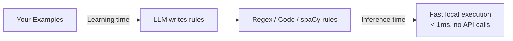
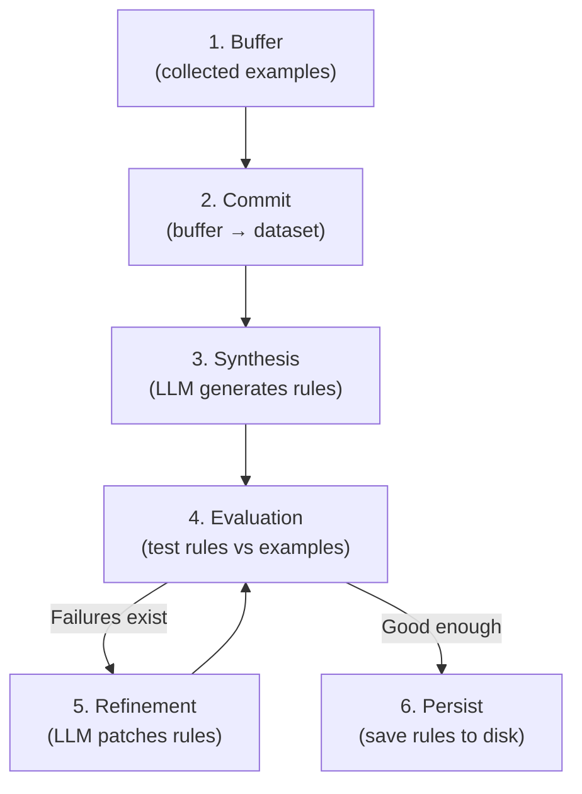

# How RuleChef Works

RuleChef turns labeled examples into fast, deterministic rules. The key idea: **an LLM writes the rules, but the rules run without any LLM**.



This page explains the core architecture. For API details, see the [Quick Start](quickstart.md).

## The Pipeline

When you call `chef.learn_rules()`, here's what happens:



Each step in detail:

### 1. Buffer

When you call `add_example()` or `add_correction()`, data goes into a **buffer** — not directly into the dataset. This lets you collect many examples before learning, and gives the [coordinator](../guide/coordinators.md) a chance to decide *when* and *how* to learn.

```python
chef.add_example(input1, output1)   # → buffer
chef.add_example(input2, output2)   # → buffer
chef.add_correction(input3, wrong, correct)  # → buffer (high priority)

# Nothing has been learned yet — examples are waiting in the buffer
```

### 2. Commit

When `learn_rules()` is called, buffered examples are committed to the dataset. The dataset is the permanent store — it persists to disk and accumulates across learning rounds.

### 3. Synthesis

The LLM receives a prompt containing:

- **Task description** — what you're trying to do
- **Training examples** — input/output pairs from the dataset
- **Data evidence** — regex pattern hints from [grex](../guide/advanced.md#using-grex-for-regex-suggestions) (if enabled)
- **User feedback** — any guidance you've added
- **Format instructions** — how to write regex/code/spaCy rules

The LLM returns a set of rules in JSON format. Each rule has a pattern (regex, code function, or spaCy matcher) and an output template.

For multi-class tasks (NER, classification), synthesis can run **per-class** — one LLM call per class, each with positive examples (capped to `max_samples`) and counter-examples from other classes. See [Prompt Size Controls](../guide/learning.md#prompt-size-controls) for details.

### 4. Evaluation

Rules are tested against the dataset. RuleChef computes:

- Per-example: did the rules produce the correct output?
- Per-class: precision, recall, F1 for each label
- Overall: micro/macro F1, exact match accuracy

Any examples where rules fail are collected as **failures**.

### 5. Refinement

If failures exist and iterations remain, RuleChef sends the LLM a **patch prompt** containing:

- Current rules (what's already working)
- Specific failures (what's broken, with expected vs actual output)
- Coordinator guidance (which classes to focus on)

The LLM generates **patch rules** targeted at the failures. These are merged into the existing ruleset — stable rules are preserved.

### 6. Persist

The final rules are saved to disk as JSON. When you create a new `RuleChef` with the same `dataset_name` and `storage_path`, rules load automatically.

## What Are Rules?

A rule is a pattern that maps input text to structured output. There are three formats:

### Regex Rules

A regex pattern with an output template. When the pattern matches, the template fills in the output:

```
Pattern:  (?i)\b(\d+\s*mg)\b
Template: {"text": "$0", "type": "DOSAGE", "start": "$start", "end": "$end"}
```

`$0` is the full match, `$1`/`$2` are capture groups, `$start`/`$end` are character offsets. The rule engine computes positions — the LLM never predicts offsets.

### Code Rules

A Python function that takes input data and returns structured output:

```python
def extract(input_data):
    import re
    text = input_data["text"]
    spans = []
    for m in re.finditer(r'\b[A-Z][a-z]+ine\b', text):
        spans.append({"text": m.group(), "start": m.start(), "end": m.end(), "type": "DRUG"})
    return spans
```

Code rules run in a [restricted sandbox](../guide/advanced.md#code-rule-security) — no imports, no file access, no network calls.

### spaCy Rules

Token or dependency matcher patterns using linguistic attributes (POS tags, lemmas, dependency relations). Requires `pip install rulechef[spacy]`.

## Schemas

### Task Definition

A `Task` tells RuleChef what you're trying to do:

```python
task = Task(
    name="Medical NER",
    description="Extract drugs, dosages, and conditions",
    input_schema={"text": "str"},
    output_schema={"entities": "List[{text: str, start: int, end: int, type: DRUG|DOSAGE|CONDITION}]"},
    type=TaskType.NER,
    text_field="text",
)
```

- **`input_schema`** — tells the LLM what input fields exist (so it writes `input_data["text"]` in code rules)
- **`output_schema`** — tells the LLM what output structure to produce (entity fields, label names)
- **`type`** — determines evaluation logic and prompt templates
- **`text_field`** — which input field regex/spaCy rules match against

Schemas are documentation for the LLM, not executed code. You can also use [Pydantic models](../guide/advanced.md#pydantic-output-schemas) for type-safe validation.

## Coordinators

A coordinator decides **when** to learn and **how** to guide refinement:

| Coordinator | How It Decides |
|-------------|---------------|
| `SimpleCoordinator` | Threshold-based: learn after N examples, refine after M corrections |
| `AgenticCoordinator` | LLM-guided: analyzes per-class metrics, focuses on weak classes, stops when performance plateaus |

The agentic coordinator also supports [rule pruning](../guide/coordinators.md#rule-pruning) — merging redundant rules and removing noise after learning.

See [Coordinators](../guide/coordinators.md) for details.

## The LLM's Role

The LLM is used **only during learning** — never during extraction:

| Operation | LLM Used? | When |
|-----------|-----------|------|
| `add_example()` | No | Just stores in buffer |
| `learn_rules()` | **Yes** | Synthesis + refinement prompts |
| `extract()` | No | Runs rules locally |
| `evaluate()` | No | Runs rules locally |

After learning, the rules are self-contained. You can serialize them, ship them to a different machine, and run them without any LLM access.

## Next Steps

- [Quick Start](quickstart.md) — code examples for all task types
- [Learning & Refinement](../guide/learning.md) — buffer architecture, sampling strategies, incremental patching
- [Coordinators](../guide/coordinators.md) — simple vs agentic, rule pruning
- [Evaluation & Feedback](../guide/evaluation.md) — metrics, corrections, custom matchers
