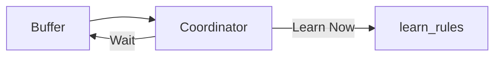

# Coordinators

Coordinators decide *when* to learn and *how* to approach refinement. They sit between the buffer and the learner.



## SimpleCoordinator

The default coordinator uses threshold-based heuristics:

```python
from rulechef import SimpleCoordinator

coordinator = SimpleCoordinator(
    trigger_threshold=10,    # Min new examples before first learn
    correction_threshold=5,  # Min corrections before refinement
)

chef = RuleChef(task, client, coordinator=coordinator)
```

### Decision Logic

**First learn** (no rules yet):

- Triggers when `new_examples >= trigger_threshold`

**Subsequent learns** (rules exist):

- If `new_corrections >= correction_threshold` → `corrections_first` strategy
- Elif `new_examples >= trigger_threshold` → `diversity` strategy
- Otherwise → wait

### Auto-Trigger

With `auto_trigger=True`, the coordinator is checked after every `add_example()` and `add_correction()`:

```python
chef = RuleChef(task, client,
    coordinator=coordinator,
    auto_trigger=True,
)

# Learning happens automatically when coordinator decides it's time
chef.add_example(input1, output1)
chef.add_example(input2, output2)
# ... after enough examples, learn_rules() fires automatically
```

## AgenticCoordinator

The `AgenticCoordinator` uses LLM calls to guide refinement, focusing on weak classes:

```python
from rulechef import AgenticCoordinator

coordinator = AgenticCoordinator(client, model="gpt-4o-mini")
chef = RuleChef(task, client, coordinator=coordinator)

chef.learn_rules(max_refinement_iterations=10)
```

Each iteration, the agentic coordinator:

1. Analyzes per-class metrics
2. Identifies weak classes that need more rules
3. Generates targeted guidance for the synthesis prompt
4. Decides when to stop (performance plateau or good enough)

!!! note "Extra required"
    The agentic coordinator requires `pip install rulechef[agentic]`.

## Custom Coordinators

Implement the `CoordinatorProtocol`:

```python
from rulechef.coordinator import CoordinatorProtocol, CoordinationDecision

class MyCoordinator(CoordinatorProtocol):
    def should_trigger_learning(self, buffer, current_rules):
        """Decide whether to trigger learning."""
        stats = buffer.get_stats()
        return CoordinationDecision(
            should_learn=stats["new_examples"] >= 5,
            strategy="balanced",
            reasoning="Custom logic",
            max_iterations=3,
        )

    def analyze_buffer(self, buffer):
        """Return analysis dict for inspection."""
        return buffer.get_stats()

    def guide_refinement(self, eval_result, iteration, max_iterations):
        """Return (guidance_text, should_continue)."""
        if eval_result and eval_result.micro_f1 > 0.9:
            return "", False  # Stop — good enough
        return "Focus on recall", True

    def on_learning_complete(self, rules, eval_result):
        """Called after learning finishes."""
        pass
```

### CoordinationDecision Fields

| Field | Type | Description |
|-------|------|-------------|
| `should_learn` | `bool` | Whether to trigger learning |
| `strategy` | `str` | Sampling strategy (`balanced`, `diversity`, `corrections_first`) |
| `reasoning` | `str` | Human-readable explanation |
| `max_iterations` | `int` | Max refinement iterations (default: 3) |
| `metadata` | `dict` | Arbitrary metadata (default: `{}`) |
