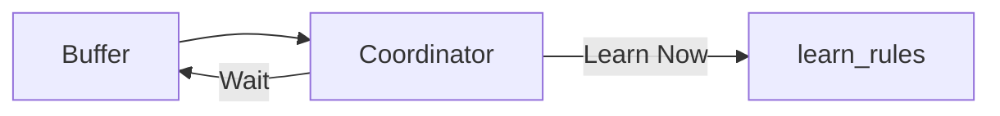

# Coordinators

Coordinators decide *when* to learn and *how* to approach refinement. They sit between the buffer and the learner.


```mermaid
flowchart LR
    A[Buffer] --> B[Coordinator]
    B -->|Learn Now| C[learn_rules]
    B -->|Wait| A
```

## SimpleCoordinator

The default coordinator uses threshold-based heuristics:

```python
from rulechef import SimpleCoordinator

coordinator = SimpleCoordinator(
    trigger_threshold=50,    # Min new examples before first learn
    correction_threshold=10, # Min corrections before refinement
)

chef = RuleChef(task, client, coordinator=coordinator)
```

### Decision Logic

**First learn** (no rules yet):

- Triggers when `new_examples >= trigger_threshold`

**Subsequent learns** (rules exist):

- If `new_corrections >= correction_threshold` → `corrections_first` strategy
- Elif `new_examples >= trigger_threshold` → `diversity` strategy
- Otherwise → wait

### Auto-Trigger

With `auto_trigger=True`, the coordinator is checked after every `add_example()` and `add_correction()`:

```python
chef = RuleChef(task, client,
    coordinator=coordinator,
    auto_trigger=True,
)

# Learning happens automatically when coordinator decides it's time
chef.add_example(input1, output1)
chef.add_example(input2, output2)
# ... after enough examples, learn_rules() fires automatically
```

## AgenticCoordinator

The `AgenticCoordinator` uses LLM calls to guide refinement, focusing on weak classes:

```python
from rulechef import AgenticCoordinator

coordinator = AgenticCoordinator(client, model="gpt-4o-mini")
chef = RuleChef(task, client, coordinator=coordinator)

chef.learn_rules(max_refinement_iterations=10)
```

Each iteration, the agentic coordinator:

1. Analyzes per-class metrics
2. Identifies weak classes that need more rules
3. Generates targeted guidance for the synthesis prompt
4. Decides when to stop (performance plateau or good enough)

!!! note "Extra required"
    The agentic coordinator requires `pip install rulechef[agentic]`.

### Rule Pruning

Over multiple refinement iterations, rulesets can accumulate redundant rules. Enable `prune_after_learn` to audit and consolidate rules after learning:

```python
coordinator = AgenticCoordinator(
    client,
    model="gpt-4o-mini",
    prune_after_learn=True,
    audit_interval=3,    # Run mid-refinement audit every N iterations (default: 3, 0 to disable)
)
chef = RuleChef(task, client, coordinator=coordinator)
chef.learn_rules()
```

The audit prefers **merging** over removing:

- **Merge**: Two regex rules with similar patterns targeting the same label get combined into one (e.g. `(?:bad|awful)` + `(?:terrible|worst)` → `(?:bad|awful|terrible|worst)`)
- **Remove**: Only rules that are pure noise (precision=0, all matches are false positives)

A safety net re-evaluates after pruning and **reverts all changes** if F1 drops by more than 1%. Rules with low scores are kept -- they may cover rare edge cases not in the training set.

In the CLI: `learn --agentic --prune`.

### Critic Agent

Enable `enable_critic` to run an LLM critic before refinement. The critic acts like a human domain expert — it reviews the entire ruleset with per-rule metrics, false positive/negative examples, and per-class performance, then provides actionable feedback:

```python
coordinator = AgenticCoordinator(
    client,
    model="gpt-4o-mini",
    prune_after_learn=True,
    enable_critic=True,
    critic_interval=4,   # Run critic every N iterations (default: 4, 0 to disable)
)
```

The critic runs periodically during refinement (controlled by `critic_interval`) and writes feedback using the same mechanism as `add_feedback()`:

- **Rule-level feedback**: Specific advice per rule (e.g., "Narrow `\d+` by adding context for dollar amounts")
- **Task-level feedback**: Strategic guidance about class disambiguation and priority ordering

This feedback is automatically picked up by the patch prompt in subsequent refinement iterations. Critic feedback is tagged with `source="critic"` and refreshed each learning cycle.

## Custom Coordinators

Implement the `CoordinatorProtocol`:

```python
from rulechef.coordinator import CoordinatorProtocol, CoordinationDecision, AuditResult

class MyCoordinator(CoordinatorProtocol):
    def should_trigger_learning(self, buffer, current_rules):
        """Decide whether to trigger learning."""
        stats = buffer.get_stats()
        return CoordinationDecision(
            should_learn=stats["new_examples"] >= 5,
            strategy="balanced",
            reasoning="Custom logic",
            max_iterations=3,
        )

    def analyze_buffer(self, buffer):
        """Return analysis dict for inspection."""
        return buffer.get_stats()

    def guide_refinement(self, eval_result, iteration, max_iterations):
        """Return (guidance_text, should_continue)."""
        if eval_result and eval_result.micro_f1 > 0.9:
            return "", False  # Stop — good enough
        return "Focus on recall", True

    def on_learning_complete(self, old_rules, new_rules, metrics):
        """Called after learning finishes."""
        pass

    def audit_rules(self, rules, rule_metrics):
        """Return AuditResult with merge/remove actions. Default: no-op."""
        return AuditResult()

    def critique_rules(self, rules, rule_metrics, eval_result, dataset):
        """Return feedback dict or None. Default: no critique."""
        return None
```

### CoordinationDecision Fields

| Field | Type | Description |
|-------|------|-------------|
| `should_learn` | `bool` | Whether to trigger learning |
| `strategy` | `str` | Sampling strategy (`balanced`, `diversity`, `corrections_first`) |
| `reasoning` | `str` | Human-readable explanation |
| `max_iterations` | `int` | Max refinement iterations (default: 3) |
| `metadata` | `dict` | Arbitrary metadata (default: `{}`) |
