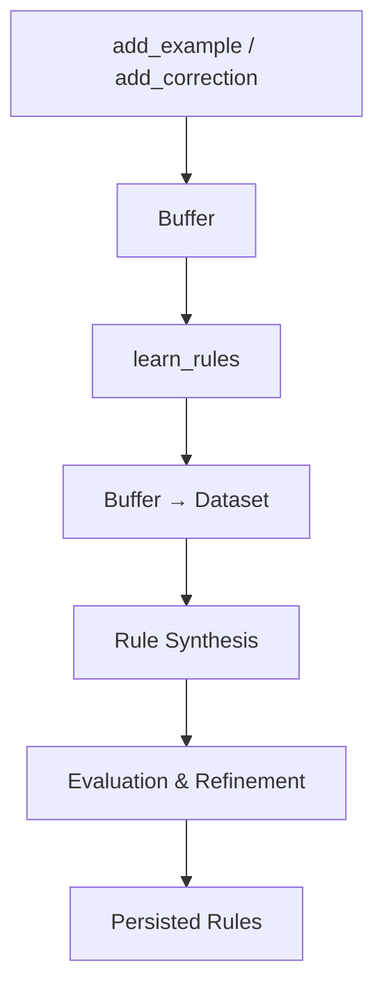

# Learning & Refinement

RuleChef uses a buffer-first architecture: examples are collected, then committed to a dataset and used for rule synthesis during `learn_rules()`.

## Buffer-First Architecture



```python
chef.add_example(input1, output1)   # Goes to buffer
chef.add_example(input2, output2)   # Goes to buffer
chef.add_correction(input3, wrong, correct)  # High-priority signal

chef.learn_rules()  # Buffer → Dataset → Synthesis → Refinement
```

## learn_rules()

The main learning method orchestrates the full pipeline:

```python
rules, eval_result = chef.learn_rules(
    max_refinement_iterations=3,  # Evaluation-refinement cycles
    incremental_only=False,       # If True, only patch (don't re-synthesize)
)
```

**What happens during `learn_rules()`:**

1. Buffer examples are committed to the dataset
2. Rules are synthesized using the LLM
3. Rules are evaluated against the dataset
4. Failed examples drive refinement iterations
5. Rules are persisted to disk

**Returns:** A tuple of `(List[Rule], Optional[EvalResult])`.

## Synthesis Strategies

For multi-class tasks (NER, classification), RuleChef can synthesize rules per-class for better coverage:

```python
# Auto-detect: per-class if >1 class, bulk otherwise (default)
chef = RuleChef(task, client, synthesis_strategy="auto")

# Force per-class synthesis
chef = RuleChef(task, client, synthesis_strategy="per_class")

# Force single-prompt bulk synthesis
chef = RuleChef(task, client, synthesis_strategy="bulk")
```

Per-class synthesis generates rules for each label separately, which helps when classes have distinct patterns.

## Incremental Patching

After the initial learn, you can patch rules for specific failures without re-synthesizing everything:

```python
# Initial synthesis
chef.learn_rules()

# Add corrections for failures
chef.add_correction(
    {"text": "some input"},
    model_output={"label": "wrong"},
    expected_output={"label": "correct"},
)

# Patch existing rules (don't re-synthesize)
chef.learn_rules(incremental_only=True)
```

Incremental patching:

- Generates targeted rules for known failures
- Merges new rules into the existing ruleset
- Prunes weak rules that don't contribute
- Preserves stable rules that are working

## Sampling Strategies

Control how training data is selected for synthesis prompts:

```python
chef = RuleChef(task, client, sampling_strategy="balanced")
```

| Strategy | Behavior |
|----------|----------|
| `balanced` | Equal representation across classes |
| `recent` | Favor recently added examples |
| `diversity` | Maximize input variety |
| `varied` | Mix of strategies across iterations |

## Persistence

Rules and datasets are automatically saved to disk:

```python
chef = RuleChef(task, client,
    dataset_name="my_project",       # Filename for the dataset
    storage_path="./rulechef_data",  # Directory for JSON files
)
```

Files saved:

- `{storage_path}/{dataset_name}.json` — dataset with examples, corrections, rules

Loading happens automatically when a matching file exists at the storage path.

## Max Rules and Samples

```python
chef = RuleChef(task, client,
    max_rules=10,    # Max rules per synthesis call
    max_samples=50,  # Max training examples in prompts
)
```
