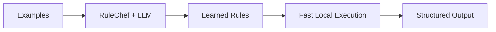

# RuleChef

**Learn rule-based models from examples using LLM-powered synthesis.**

RuleChef learns regex, Python code, and spaCy patterns from labeled examples using LLM-powered synthesis. You provide examples, RuleChef generates rules, and those rules run locally without any LLM at inference time.

## Why Rules Instead of LLMs?

| | LLM Inference | RuleChef Rules |
|---|---|---|
| **Cost** | ~$0.01 per call | Free (no API calls) |
| **Latency** | 200-2000ms | <0.1ms |
| **Determinism** | Varies between calls | Same input = same output |
| **Inspectability** | Black box | Readable, editable rules |
| **Drift** | Model updates change behavior | Rules don't change unless you change them |

## How It Works



1. **Provide examples** — labeled input/output pairs
2. **RuleChef synthesizes rules** — using LLM-powered generation
3. **Rules run locally** — regex, code, or spaCy patterns with zero LLM cost

## Quick Example

```python
from openai import OpenAI
from rulechef import RuleChef, Task, TaskType

client = OpenAI()
task = Task(
    name="Year Extraction",
    description="Extract year spans from text",
    input_schema={"text": "str"},
    output_schema={"spans": "List[Span]"},
    type=TaskType.EXTRACTION,
)

chef = RuleChef(task, client)
chef.add_example(
    {"text": "Built in 1991"},
    {"spans": [{"text": "1991", "start": 9, "end": 13}]}
)
chef.learn_rules()

result = chef.extract({"text": "Founded in 1997"})
# {"spans": [{"text": "1997", "start": 11, "end": 15}]}
```

## What It Supports

- **Extraction** — find text spans
- **NER** — typed entities with schema enforcement
- **Classification** — single-label categorization
- **Transformation** — structured field extraction

Rules can be **regex**, **Python code**, or **spaCy** token/dependency patterns.

## Next Steps

- [Installation](getting-started/installation.md) — install RuleChef and extras
- [Quick Start](getting-started/quickstart.md) — full examples for all task types
- [Benchmarks](benchmarks.md) — Banking77 classification results
